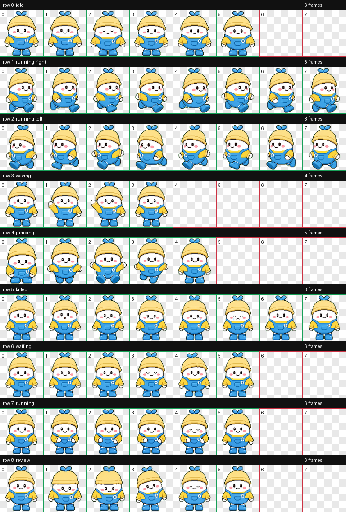

# 小阿噗 Apu Codex Pet

小阿噗是一个为 Codex 定制的卡通工作伙伴。小阿噗是好未来的吉祥物，他是一颗胖嘟嘟的种子宝宝，与好未来logo树概念相呼应。它戴着奶油黄色小帽，头顶有蓝色蝴蝶结，穿着亮蓝色背带裤和黄色上衣，脸上有柔软的粉色腮红。整体形象圆润、干净、轻快，适合在写代码、等测试、做 review 的时候陪在界面角落里。

<video src="assets/apu-demo.mp4" controls muted playsinline width="720"></video>

[查看原始录屏 MOV](assets/apu-demo.mov)



角色参考图保存在 [assets/source-reference.png](assets/source-reference.png)，Codex 可用成品在 [pet/](pet/) 目录。

## 角色设定

小阿噗的性格是温和、好奇、认真又带一点点元气。它不像一个吵闹的提示器，更像一个安静坐在旁边的小搭档：你在思考时它会轻轻待机，你推进任务时它会跑起来，遇到失败时它会短暂沮丧但不会泄气，等你重新开工时又会乖乖跟上。

视觉上，小阿噗采用软胶玩具质感和高明度配色：

- 白色圆脸让表情非常清楚，适合小尺寸显示。
- 蓝色背带裤和鞋子提供稳定的品牌识别。
- 黄色上衣与帽子让角色看起来明亮、友好、有工作服的感觉。
- 胸前小徽章像一枚轻量的协作标记，给角色一点“Codex 工作伙伴”的身份感。
- 圆手、短腿和大比例头身让动作读起来更可爱，也更适合循环动画。

## 动画状态

这个 pet 包含 Codex pet atlas 所需的 8x9 精灵图结构，单帧尺寸为 `192x208`，整张 spritesheet 为 `1536x1872`，格式为透明背景 `WEBP/RGBA`。

| 状态 | 说明 | 预览 |
| --- | --- | --- |
| `idle` | 安静待机，像是在陪你整理思路。 | [idle.mp4](assets/qa/videos/idle.mp4) |
| `running-right` | 向右小跑，适合任务推进状态。 | [running-right.mp4](assets/qa/videos/running-right.mp4) |
| `running-left` | 向左小跑，保持左右移动一致。 | [running-left.mp4](assets/qa/videos/running-left.mp4) |
| `waving` | 挥手打招呼，适合欢迎和互动。 | [waving.mp4](assets/qa/videos/waving.mp4) |
| `jumping` | 轻轻跳起，表现完成或开心。 | [jumping.mp4](assets/qa/videos/jumping.mp4) |
| `failed` | 失败时短暂低落，但仍然很可爱。 | [failed.mp4](assets/qa/videos/failed.mp4) |
| `waiting` | 等待时保持耐心，不抢注意力。 | [waiting.mp4](assets/qa/videos/waiting.mp4) |
| `running` | 通用运行状态，用于忙碌中的反馈。 | [running.mp4](assets/qa/videos/running.mp4) |
| `review` | review 时更专注，像在认真看 diff。 | [review.mp4](assets/qa/videos/review.mp4) |

## 安装

把 `pet/` 目录复制到你的 Codex pets 目录：

```bash
mkdir -p ~/.codex/pets/apu
cp pet/pet.json pet/spritesheet.webp ~/.codex/pets/apu/
```

然后在 Codex 的 pet/appearance 设置里选择自定义 pet `小阿噗`。如果界面已经打开，可能需要刷新 Codex 或重新打开 pet 面板。

## 文件结构

```text
apu-codex-pet/
├── pet/
│   ├── pet.json
│   └── spritesheet.webp
├── assets/
│   ├── contact-sheet.png
│   ├── validation.json
│   ├── review.json
│   └── qa/videos/*.mp4
├── README.md
├── LICENSE
└── .gitignore
```

## 质量检查

- Atlas: `8 x 9`
- Frame size: `192 x 208`
- Spritesheet: `1536 x 1872`
- Format: `WEBP`
- Mode: `RGBA`
- Validation: passed, no errors or warnings
- QA videos: generated for all 9 animation previews

## 开源许可

本仓库使用 MIT License 发布。你可以自由使用、修改、再分发小阿噗，包括在自己的 Codex 环境中继续创作衍生版本。
